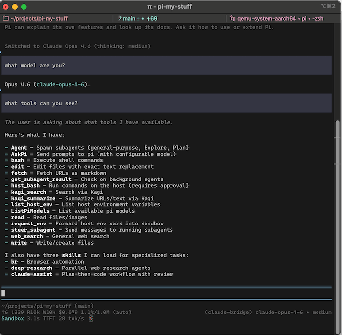
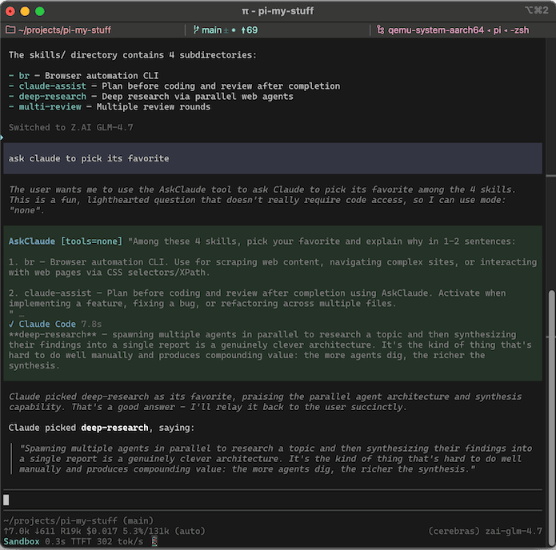

# pi-claude-bridge

[](https://www.npmjs.com/package/pi-claude-bridge)

Pi extension that integrates Claude Code via the [Agent SDK](https://github.com/anthropics/claude-agent-sdk-typescript). Based initially on [claude-agent-sdk-pi](https://github.com/prateekmedia/claude-agent-sdk-pi) by Prateek Sunal. This fork adds streaming, MCP tool bridging, custom pi tool bridging, session resume/persistence, context sync, thinking support, skills forwarding, and many correctness fixes.

1. **Provider** — Use Opus/Sonnet/Haiku as models in pi, with all tool calls flowing through pi's TUI
2. **AskClaude tool** — Delegate tasks or questions to Claude Code when using another provider


**FYI:** Anthropic [announced and then unannounced](https://support.claude.com/en/articles/15036540-use-the-claude-agent-sdk-with-your-claude-plan) a change to how you would be billed for tools that use the Agent SDK like this one. It currently uses your regular subscription quota just like Claude Code.

<p>
<a href="assets/claude-bridge1.png"></a>&nbsp;
<a href="assets/claude-bridge2.png"></a>
</p>

## Install

```
pi install npm:pi-claude-bridge
```

## Provider

Use `/model` to select `claude-bridge/claude-fable-5`, `claude-bridge/claude-opus-5`, `claude-bridge/claude-opus-4-8`, `claude-bridge/claude-opus-4-7`, `claude-bridge/claude-opus-4-6`, `claude-bridge/claude-sonnet-5`, `claude-bridge/claude-sonnet-4-6`, or `claude-bridge/claude-haiku-4-5`.

Behind the scenes, pi's tools are bridged to Claude Code but it should all work like normal in pi. Bash commands get a 120-second default timeout (matching Claude Code's default) since pi's bash has no timeout by default. Skills in pi are copied over to Claude Code's system prompt so should work as they would with any other pi provider. Steering works mid-turn: a message sent while Claude is running a tool reaches it at that tool boundary, not after the whole turn finishes.

**1M Context:** Opus 5, Opus 4.8, and Opus 4.7 get 1M context by default. Opus 4.6 only gets 1M if you're on a Max plan or pay for Extra Usage. Sonnet 4.6 only gets 1M if you pay for Extra Usage. You will need to set `provider.plan` and/or `provider.longContextExtraUsage` for 1M context in Opus 4.6/Sonnet 4.6 as described in [Configuration](#configuration).

## AskClaude Tool

Opt-in: set `askClaude.enabled` to `true` (see [Configuration](#configuration)). Available when using any non-claude-bridge provider. Pi's LLM can delegate tasks to Claude Code and wait for it to answer a question or perform a task. Examples of how to use:

- "Ask Claude to plan a fix"
- "If you get stuck, ask claude for help"
- "Ask claude to review the plan in @foo.md, implement it, then ask an isolated=true claude to review the implementation"
- "Ask claude to poke holes in this theory"
- "Find all the places in the codebase that handle auth"

You could also create skills or add something to AGENTS.md to e.g. "Always call Ask Claude to review complicated feature implementations before considering the task complete."

### Parameters

- **`prompt`** — the question or task for Claude Code
- **`mode`** — `read` (default, read files and search/fetch on web), `none`, or `full` (read+write+bash, disable this mode with `allowFullMode: false` in config)
- **`model`** — `opus` (default), `sonnet`, `haiku`, or a full model ID
- **`thinking`** — effort level: `off`, `minimal`, `low`, `medium`, `high`, `xhigh`
- **`isolated`** — when `true`, Claude gets a clean session with no conversation history (default: `false`)

### Context isolation

AskClaude children do not inherit your `~/.claude` context. `CLAUDE.md` files (the user-level one, ancestor and project copies, and `.claude/rules/`) are excluded, and the child is started with no skills of its own, so it does not see Claude Code's global skill listing. The reasoning is that pi owns the context on this path: a persona written for a different harness should not arrive stamped "these instructions override any default behavior" and outrank pi's own AGENTS.md. Managed policy memory is not excludable and still loads.

Pi's own skills are a separate channel and still reach the child, appended to the system prompt, unless you set `appendSkills: false`. This is worth knowing if you expect a child to follow an instruction that only exists in your global `CLAUDE.md`: it will not. Put it in a pi-side skill or in AGENTS.md instead.

## Configuration

Config: `~/.pi/agent/claude-bridge.json` (global) or the project Pi config directory, usually `.pi/claude-bridge.json` (project; merged over global).

```json
{
  "askClaude": {
    "enabled": true,
    "allowFullMode": true,
    "defaultIsolated": false,
    "description": "Custom tool description override"
  },
  "provider": {
    "plan": "max",
    "longContextExtraUsage": false,
    "strictMcpConfig": true,
    "pathToClaudeCodeExecutable": "/home/you/.nix-profile/bin/claude"
  }
}
```

`askClaude`:
- `enabled` — register the AskClaude tool (default `false`). If it's unset, the startup notice below points this out once.
- `name` — override the tool's pi-side name (default `"AskClaude"`)
- `label` — override the TUI label (default `"Ask Claude Code"`)
- `description` — override the tool description. Default when `allowFullMode: true`: *"Delegate to Claude Code for a second opinion or analysis (code review, architecture questions, debugging theories), or to autonomously handle a task. Defaults to read-only mode — use full mode when the user wants to delegate a task that requires changes. Prefer to handle straightforward tasks yourself."*
- `defaultMode` — `"read"` (default), `"none"`, or `"full"`
- `defaultIsolated` — start each call in a fresh session (default `false`)
- `allowFullMode` — allow `mode: "full"`; set `false` to lock it out
- `appendSkills` — forward pi's skills block into the system prompt (default `true`)

`provider`:
- `plan` (default `"pro"`) — set to `"max"` if you have a Max (or Team Premium/Enterprise) Anthropic plan. This enables Opus with 1M context.
- `longContextExtraUsage` — set to `true` to enable 1M context models even if they cost money through Extra Usage on your plan. It enables Sonnet 4.6 with 1M on every plan and Opus 4.6 with 1M on Pro. Not needed for Opus 4.7 or 4.8.
- `strictMcpConfig` — block MCP servers from `~/.claude.json` / `.mcp.json` (default `true`). Cloud MCP (Gmail/Drive via claude.ai OAuth) is always blocked.
- `autoMemoryEnabled` — enable Claude Code's auto-memory system (default `false`)
- `pathToClaudeCodeExecutable` — path to the `claude` binary. Useful if your OS/filesystem has the SDK's bundled musl/glibc binaries in a place where they can't run. For example, with Nix you can set the binary to e.g. `"/home/you/.nix-profile/bin/claude"`.


**Startup notice:** the first interactive session to reach Claude Code lists whichever of `provider.plan` and `askClaude.enabled` you have left unset, then records `startupNoticeShown` (the date, `YYYY-MM-DD`) in the global config so it doesn't nag again.

**Extension providers and models.json:** pi's `modelOverrides` in `~/.pi/agent/models.json` do not currently apply to extension-registered providers (like claude-bridge). Overriding `contextWindow` or other fields requires editing `src/models.ts` directly.

## Tests

`npm run test:unit` for offline tests (`tests/unit-*.mjs`: queue, import, skills). 

`npm test` for the full suite, which adds integration tests that hit APIs (`tests/int-*.{sh,mjs}`: smoke, multi-turn, cache, session-resume, session-rebuild, tool-message). The alt-provider tests need two variables in `.env.test`, and both are required: `require_env` aborts the run if either is missing.

- `CLAUDE_BRIDGE_TESTING_ALT_PROVIDER` — the pi provider to run the non-claude-bridge side of the test against, e.g. `openrouter`
- `CLAUDE_BRIDGE_TESTING_ALT_MODEL` — the model ID **without** the provider prefix, e.g. `google/gemini-2.5-flash`

The model must tolerate reasoning being disabled: pi sends reasoning effort `none` when thinking is off, and some OpenRouter endpoints reject that outright.

Integration tests spawn real `pi` and Claude Code subprocesses, so they need write access to `~/.claude` for CC's session state — a sandbox that blocks it makes the next turn's `--resume` fail with `No conversation found with session ID`. The RPC harness probes for this at startup and fails fast.

## Debugging

Set `CLAUDE_BRIDGE_DEBUG=1` to enable debug output:

- **Bridge log** at `~/.pi/agent/claude-bridge.log` — every provider call, session sync decision, tool result delivery, and CC's stderr. Override location with `CLAUDE_BRIDGE_DEBUG_PATH`.
- **Per-query Claude Code CLI logs** at `~/.pi/agent/cc-cli-logs/<timestamp>-<tag>-<seq>.log` — the CC subprocess's own debug stream, one file per `query()` call. Tags are `provider` (main turn) or `askclaude` (sub-delegation). Useful when a resume fails or CC misbehaves internally — shows the CLI's own view of session loading, API requests, and tool calls.

When filing a bug about a session-resume failure (e.g. "No conversation found"), the most useful attachments are the `syncResult:` lines from the bridge log plus the matching `cc-cli-logs/` file for the failing query.

Two other environment variables matter here:

- **`CLAUDE_CONFIG_DIR`** — Claude Code's own variable, honored by the bridge everywhere it opens, creates or deletes a session. It decides which directory the session JSONL files are read from and written to, so it is the first thing to check when resume fails: if the bridge and the `claude` binary disagree about it, the session the bridge wrote is not the one CC looks for. Its current value is included in the session-verify warning and in the debug log, and it appears as `(unset)` when it isn't set.
- **`CLAUDE_BRIDGE_RECORD_STREAM=<path>`** — appends every SDK message the bridge sees to that path, one JSON object per line. This is the capture mechanism for replay fixtures (`tests/lib/record-sdk-streams.mjs`), so unit tests can assert against message shapes Claude Code really emitted. Not needed for normal debugging.

## Known issues

**Sessions get rebuilt more often than they need to be, and a rebuild is expensive.** The bridge rewrites Claude Code's session from pi's history whenever pi's messages move underneath it — after an abort, `/compact`, tree navigation, or an API error. Measured over this repo's own bridge log, a rebuild boundary loses the prompt cache roughly 58% of the time against 26% for a plain resume, so an abort-heavy session costs noticeably more than a clean one. Aborts alone are 46% of rebuilds.

**Files Claude Code edits are not carried across a rebuild.** CC records the post-edit contents as an `edited_text_file` attachment; those aren't carried, because they hang off a tool-result record rather than a prompt and so have no stable position to restore them to. The edit itself survives — it's in the history as a tool call and its result — so this costs Claude the file snapshot, not the knowledge that it made the change. `@file` expansions *are* carried.
